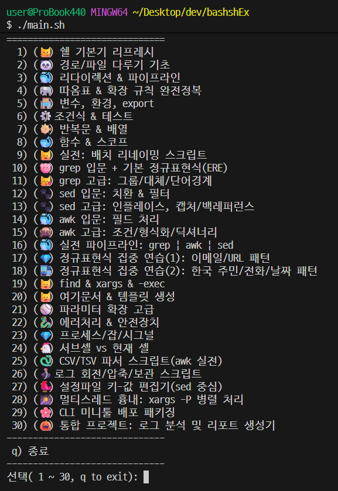

# Bash Shell Exercising with some examples

Bash 셸(Bourne Again SHell)은 리눅스 및 유닉스 계열 운영체제에서 널리 사용되는 명령어 해석기이자 스크립트 언어입니다.

```bash
Bash 셸은 명령 실행의 효율성, 자동화 기능, 그리고
리눅스 시스템 관리 및 개발의 필수적인 도구이기 때문에 사용됩니다.
사용자가 터미널에서 직접 명령을 입력할 수 있을 뿐만 아니라,
셸 스크립트를 작성해 반복적인 작업을 자동화하고
시스템 관리를 효율적으로 할 수 있습니다.

Bash 셸을 사용하는 주요 이유
1. 명령어 실행 및 시스템 관리: 터미널에서 직접 명령을 입력하여
  시스템 작업을 수행할 수 있습니다. 리눅스 시스템 관리자에게 필수적인 도구입니다.

2. 작업 자동화: 셸 스크립트(shell script)를 작성하여
  파일 복사, 프로그램 실행, 문자열 출력 등 반복적인 작업을 자동화할 수 있습니다.

3. 효율성 증대: 복잡하거나 자주 사용하는 명령어들을
  스크립트로 만들어 두면 수많은 명령어를 일일이 입력할 필요 없이
  한 번에 실행할 수 있어 업무 효율이 크게 향상됩니다.

4. 스크립트 프로그래밍: 변수, 제어문, 함수 등 프로그래밍 문법을
  활용하여 더 복잡한 작업을 수행하는 셸 프로그램을 만들 수 있습니다.

5. 표준화: 리눅스 환경에서 가장 널리 사용되는 표준 셸이므로,
  다양한 시스템 환경에서 일관된 스크립트 실행을 보장합니다.

6. 다른 툴과의 연동: Git Bash와 같이 개발 도구와 연동하여
  사용하는 경우도 많습니다
```


```bash
# 전체 예제 30개 로드맵

1. 쉘 기본기 리프레시
  - 목표: 셸 종류, $SHELL, echo, type, which, help, man, --help 사용.
  - 키워드: 로그인 셸/비로그인, 내장/외부 명령 구분.

2. 경로/파일 다루기 기초
  - 목표: pwd, cd -, 상대/절대경로, ls -la, mkdir -p, touch, rm -i.
  - 키워드: 글로빙(*, ?, []), 숨김파일.

3. 리다이렉션 & 파이프라인
  - 목표: >, >>, <, 2>, 2>&1, |를 조합해 표준입출력 흐름 이해.
  - 키워드: tee, tee -a.

4. 따옴표 & 확장 규칙 완전정복
  # 아래 명령어는 백틱(`)을 사용합니다.
  - 목표:  ' ',  " ", 백슬래시, 명령치환 $(...), 산술 확장 $(( )).
  - 키워드: 변수확장, 경로확장, 브레이스 확장 {a,b}{1,2}.

5. 변수, 환경, export
  - 목표: 스칼라 변수, 환경변수, env, .bashrc/.zshrc 차이.
  - 키워드: PATH 관리, 일시적 환경변수 VAR=val cmd.

6. 조건식 & 테스트
  - 목표: [ ], [[ ]], 파일 테스트(-f, -d, -s), 문자열/정수 비교.
  - 키워드: if/elif/else, 종료코드 $?.

7. 반복문 & 배열
  - 목표: for/while/until, 배열(arr=(a b)), 인덱스/전체 순회.
  - 키워드: break, continue, C-스타일 for.

8. 함수 & 스코프
  - 목표: 함수 선언/호출, 반환값(종료코드), 지역변수 local.
  - 키워드: 재사용 가능한 유틸 함수 작성.

9. 실전: 배치 리네이밍 스크립트
  - 목표: 파일 확장자 일괄 변경/프리픽스 추가.
  - 키워드: 안전장치(드라이런 echo), 백업.

10. grep 입문 + 기본 정규표현식(ERE)
  - 목표: grep -n, -i, -v, -E, -r, --color, 앵커 ^$, 문자클래스.
  - 키워드: 로그에서 에러라인 추출.

11. grep 고급: 그룹/대체/단어경계
  - 목표: (...), |, \< \> 또는 \b 대응, -A/-B/-C 컨텍스트.
  - 키워드: 다중 키워드 매칭 리포트.

12. sed 입문: 치환 & 필터
  - 목표: sed -n 'p', s/old/new/, -E, 주소지정 1,10p, /PATTERN/d.
  - 키워드: 구분자 바꾸기 s@a/b@x/y@g.

13. sed 고급: 인플레이스, 캡처/백레퍼런스
  - 목표: -i.bak, 그룹 (), \1 치환, 다중 명령 -e.
  - 키워드: 버전 문자열 증가/표준화.

14. awk 입문: 필드 처리
  - 목표: awk -F, '{print $1,$3}', NR/NR==1 처리, 헤더 스킵.
  - 키워드: 합계/평균, BEGIN/END 블록.

15. awk 고급: 조건/형식화/딕셔너리
  - 목표: 조건부 합계, 해시맵(연관배열), 출력 포맷 printf.
  - 키워드: 그룹별 집계 리포트.

16. 실전 파이프라인: grep | awk | sed
  - 목표: 삼단 콤보로 로그→정리→집계.
  - 키워드: 성능/가독성 트레이드오프.

17. 정규표현식 집중 연습(1): 이메일/URL 패턴
  - 목표: grep -E, sed -E로 실전 패턴 매칭/마스킹.
  - 키워드: 안전한 마스킹(로깅용).

18. 정규표현식 집중 연습(2): 한국 주민/전화/날짜 패턴
  - 목표: 포맷 검증, 부분 추출, 형식 변환.
  - 키워드: 캡처/치환 규칙.

19. find & xargs & -exec
  - 목표: 확장자/크기/최종수정일 조건 검색.
  - 키워드: 공백 안전 -print0 | xargs -0.

20. 여기문서(Heredoc) & 템플릿 생성
  - 목표: cat <<'EOF' ... EOF로 설정파일 스캐폴딩.
  - 키워드: 변수치환 제어(퀴어팅).

21. 파라미터 확장 고급
  - 목표: ${var:-default}, ${var/%old/new}, ${var##*/} 등.
  - 키워드: 파일명 분해/확장자 교체.

22. 에러처리 & 안전장치
  - 목표: set -euo pipefail, trap '...' ERR, 임시파일 처리.
  - 키워드: 안전한 스크립트 템플릿.

23. 프로세스/잡/시그널
  - 목표: 백그라운드 &, jobs, fg/bg, kill, trap SIGINT.
  - 키워드: 그레이스풀 셧다운.

24. 서브셸 vs 현재 셸
  - 목표: ( cd dir; cmd )와 { cd dir; cmd; } 차이.
  - 키워드: 환경영향/퍼포먼스.

25. CSV/TSV 파서 스크립트(awk 실전)
  - 목표: 특정 컬럼 필터/집계/정렬.
  - 키워드: 구분자·인용부호 처리 팁.

26. 로그 회전/압축/보관 스크립트
  - 목표: 날짜 스탬프, gzip, 보관주기, 삭제 기준.
  - 키워드: cron 연동.

27. 설정파일 키-값 편집기(sed 중심)
  - 목표: key=value 갱신/삽입, 주석 유지.
  - 키워드: 존재 유무 분기.

28. 멀티스레드 흉내: xargs -P 병렬 처리
  - 목표: 대량 이미지/텍스트 변환 병렬화.
  - 키워드: 작업큐/실패 재시도.

29. CLI 미니툴 배포 패키징
  - 목표: shebang, 실행권한, $PATH에 배치, help/버전옵션.
  - 키워드: 릴리스 구조.

30. 통합 프로젝트: “로그 분석 및 리포트 생성기”
  - 목표: grep/sed/awk/find/xargs 총동원, 요약표+원본링크 산출.
  - 키워드: 모듈화, 에러처리, 테스트 데이터 포함.

```

```bash
# Project Structure
bash-tutorial/
│
├── main.sh                ← 메뉴 실행 메인 스크립트
└── lessons/
    ├── lesson01.sh
    ├── lesson02.sh
    ├── ...
    └── lesson30.sh
```

---

### main.sh 실행 화면 예시:



---

🧭 1️⃣ Git Bash의 /tmp 는 진짜 폴더가 아님

Git Bash는 Windows 위에서 리눅스 스타일 경로를 흉내내는 가상 환경(MSYS2) 을 제공합니다.
즉 /tmp 는 실제 디스크의 루트(C:\)에 있는 폴더가 아니라,
Git Bash 내부의 임시 가상 파일시스템에 매핑되어 있어요.

```bash
| Bash 경로         | 실제 Windows 경로                                             |
| ----------------- | ------------------------------------------------------------ |
| `/c/Users/Joshua` | `C:\Users\Joshua`                                            |
| `/tmp`            | `C:\Users\<계정>\AppData\Local\Temp` (또는 `C:\Windows\Temp`) |

```
